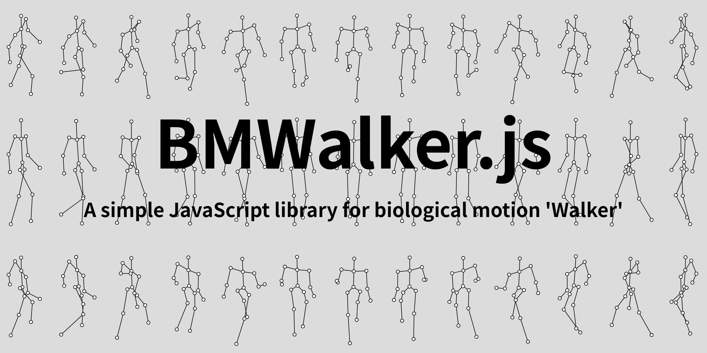
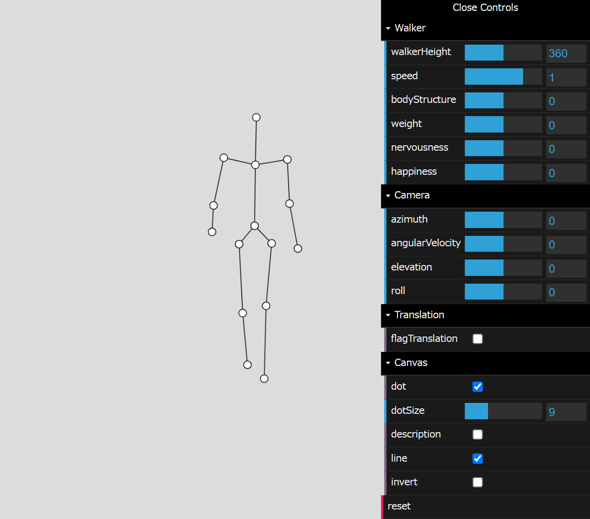

# Description 🚶‍♀️🚶

**BMWalker.js** is a simple JavaScript library supplying the marker information of the [biological motion](https://en.wikipedia.org/wiki/Biological_motion) 'Walker'.  
Now, you can draw it without difficulty!  
  
moive...

Now, the latest version is `0.5.0`(alpha release).  

## Demos
### Full function demo
 

- [Full function Demo On GitHub](https://tetunori.github.io/BMWalker.js/sample/fullFunction/index.html)
- [Full function Demo On OpenProcessing](https://openprocessing.org/user/213060)

### Application demos
- [Application Demos On GitHub](https://tetunori.github.io/BMWalker.js/application/index.html)
- [Application Demos On OpenProcessing](https://openprocessing.org/user/213060)


# Usage
## Import
```html 
<script src="https://tetunori.github.io/BMWalker.js/dist/v0.5.0/bmwalker.js"></script>
```
## Basic Usage
Just new `BMWalker()` and you can get marker coordinates via `getMarkers()` method.

```javascript
// Create biological motion walker instance
const bmw = new BMWalker();

// Get array of the current marker coordinates 
const walkerHeight = 200;
const markers = bmw.getMarkers(walkerHeight);
```
Received array consists of objects as below.

```javascript
// Return value of getMarkers()
[
  { x:  3.18, y: -170.70, desc: 'Head' },
  { x:  2.74, y: -115.11, desc: 'Clavicles' },
  { x: 40.24, y: -121.91, desc: 'L-Shoulder' },
  // ...
]
```

So we can draw gotton markers like below.
```javascript
// Draw each markers
markers.forEach((m) => {
  circle(m.x, m.y, 6);
});
```
### Example: Basic Usage
 

 - ['Example 0-1: Basic Usage' On GitHub](https://tetunori.github.io/BMWalker.js/sample/ex0-1/)
 - ['Example 0-1: Basic Usage' On OpenProcessing](https://openprocessing.org/sketch/1338726)

# API Specification
<details><summary>CLICK ME</summary>
<p>

## API List
- [Constructor](#Constructor)
- [Methods](#Methods)
  - [getMarkers](#getMarkers)
  - [getLineMarkers](#getLineMarkers)
  - [setSpeed](#setSpeed)
  - [setWalkerParam](#setWalkerParam)
  - [setCameraParam](#setCameraParam)
  - [setTranslationParam](#setTranslationParam)
  - [resetTimer](#resetTimer)

## Constructor
```javascript
new BMWalker()
```

Returns:
BMWalker instance.

## Methods
### getMarkers
```javascript
getMarkers(walkerHeight: Number, [tmsec: Number])
```

Overview:  
Get all markers that make up 'Walker'.

Parameters:
|  name  |  note  |
| ---- | ---- |
|  `walkerHeight`   | `Number`: Height size of the 'Walker'. This method returns the coordinates as the height of 'Walker' fits into this value. |
|  [`tmsec`]  | Optional. `Number`: Specify the time in msec for which you would like to get markers. If unspecified, this method returns current marker coordinates. |

Returns:  
Array of the marker data `Object` at specified time. Each data `Object` has properties below.
|  name  |  note  |
| ---- | ---- |
|  `x`  |  `Number`: x-coordinate of the marker.  |
|  `y`  |  `Number`: y-coordinate of the marker.  |
|  `desc`  |  `String`: Description of the marker like `'Head'`, `'Clavicles'` and so on.  |
```javascript
// Example of Return value of getMarkers()
[
  { x:  3.18, y: -170.70, desc: "Head" },
  { x:  2.74, y: -115.11, desc: "Clavicles" },
  { x: 40.24, y: -121.91, desc: "L-Shoulder" },
  // ...
]
```


Example1-1: getMarkers Example 1
```javascript
// Create biological motion walker instance
const bmw = new BMWalker();

// Get array of the current marker coordinates 
const walkerHeight = 100;
const markers = bmw.getMarkers(walkerHeight);

// Draw each markers
markers.forEach((m) => {
  circle(m.x, m.y, 6);
});
```
 

 - ['Example 1-1: getMarkers Example 1' On GitHub](https://tetunori.github.io/BMWalker.js/sample/ex1-1/)
 - ['Example 1-1: getMarkers Example 1' On OpenProcessing](https://openprocessing.org/sketch/1338726)


Example1-2: getMarkers Example 2
```javascript
// Create biological motion walker instance
const bmw = new BMWalker();

// Get array of the marker coordinates with bigger size and specified time. 
const walkerHeight = 350;
const specifiedTime = 500;
const markers = bmw.getMarkers(walkerHeight, specifiedTime);

// Draw each markers with descriptions
markers.forEach((m) => {
  circle(m.x, m.y, 6);
  text(m.desc, m.x, m.y + 15);
});
```
 

 - ['Example 1-2: getMarkers Example 2' On GitHub](https://tetunori.github.io/BMWalker.js/sample/ex1-2/)
 - ['Example 1-2: getMarkers Example 2' On OpenProcessing](https://openprocessing.org/sketch/1338726)

### getLineMarkers
```javascript
getLineMarkers(walkerHeight: Number, [tmsec: Number])
```
Overview:  
Get combinations of marker coordinates for both ends of all lines that make up 'Walker'.

Parameters:
|  name  |  note  |
| ---- | ---- |
|  `walkerHeight`   | `Number`: Height size of the 'Walker'. This method returns as the height of 'Walker' fits into this value. |
|  [`tmsec`]  | Optional. `Number`: Specify the time in msec for which you would like to get. If unspecified, this method returns with current time. |

Returns:
Array of the combination of 2 marker `Object`s. Each marker `Object` has properties below.
|  name  |  note  |
| ---- | ---- |
|  `x`  |  `Number`: x-coordinate of the marker.  |
|  `y`  |  `Number`: y-coordinate of the marker.  |
|  `i`  |  `Number`: Index value of the marker.  |

```javascript
// Example of Return value of getLineMarkers()
[
  [ // Line 0
    { // Marker 0
      x: -0.95,
      y: -47.4,
      i: 0,
    },
    { // Marker 1
      x: -0.76,
      y: -31.95,
      i: 1,
    },
  ],
  [ // Line 1
  // ...
]
```

Example2-1: getLineMarkers Example
```javascript
// Create biological motion walker instance
const bmw = new BMWalker();

// Get array of the current line markers
const walkerHeight = 300;
const lineMarkers = bmw.getLineMarkers(walkerHeight);

// Draw lines
lineMarkers.forEach((m) => {
  line(m[0].x, m[0].y, m[1].x, m[1].y);
});
```

 

 - ['Example 2-1: getLineMarkers Example' On GitHub](https://tetunori.github.io/BMWalker.js/sample/ex2-1/)
 - ['Example 2-1: getLineMarkers Example' On OpenProcessing](https://openprocessing.org/sketch/1338726)


### setSpeed
```javascript
setSpeed(speed: Number)
```
Overview:  
Set walking speed.

Parameters:
|  name  |  note  |
| ---- | ---- |
|  `speed`   | `Number`: Walking speed of the 'Walker'. Set values between `minSpeed` and `maxSpeed`(automtically clamped). Default value is `1.0`. Setting `0` means stop walking. Walk backward when negative values are set. |

Example 3-1: setSpeed Example
```javascript
// Create biological motion walker instance
const bmw = new BMWalker();

// Set speed with mouseX coordinate.
const spd = map(mouseX, 0, width, bmw.minSpeed, bmw.maxSpeed);
bmw.setSpeed(spd);
```
 

 - ['Example 3-1: setSpeed Example' On GitHub](https://tetunori.github.io/BMWalker.js/sample/ex3-1/)
 - ['Example 3-1: setSpeed Example' On OpenProcessing](https://openprocessing.org/sketch/1338726)


### setWalkerParam
```javascript
setWalkerParam(bodyStructure: Number, weight: Number, nervousness: Number, happiness: Number)
```
Overview:  
Set parameters on the motion of 'Walker'.

Parameters:
|  name  |  note  |
| ---- | ---- |
|  `bodyStructure`   | `Number`: Adjust parameters on body structure. Set values between `minBodyStructure` and `maxBodyStructure`(automtically clamped). Default value is `0`(means neutral). |
|  `weight`   | `Number`: Adjust parameters on weight. Set values between `minWeight` and `maxWeight`(automtically clamped). Default value is `0`(means neutral). Positive values are heavy and negative values are light. |
|  `nervousness`   | `Number`: Adjust parameters on nervousness. Set values between `minNervousness` and `maxNervousness`(automtically clamped). Default value is `0`(means neutral). Positive values are nervous and negative values are relaxed. |
|  `happiness`   | `Number`: Adjust parameters on happiness. Set values between `minHappiness` and `maxHappiness`(automtically clamped). Default value is `0`(means neutral). Positive values are happy and negative values are sad.|

Example 4-1: setWalkerParam Example
```javascript
// Create biological motion walker instance
const bmw = new BMWalker();

// Set walker parameters.
const bodyStructure = 1.0;
const weight = -0.2;
const nervousness = 0.0;
const happiness = 3.1;
bmw.setWalkerParam(bodyStructure, weight, nervousness, happiness);
```
 
 

 - ['Example 4-1: setWalkerParam Example' On GitHub](https://tetunori.github.io/BMWalker.js/sample/ex4-1/)
 - ['Example 4-1: setWalkerParam Example' On OpenProcessing](https://openprocessing.org/sketch/1338726)


### setCameraParam
```javascript
setCameraParam(azimuth: Number, angularVelocity: Number, elevation: Number, roll: Number)
```
Overview:  
Set parameters on the camera.

Parameters:
|  name  |  note  |
| ---- | ---- |
|  `azimuth`   | `Number`: The rotation angle(in radians) of the 'Walker' around the vertical axis. Set values from `-PI` to `PI`. Default value is `0`. |
|  `angularVelocity`   | `Number`: The rotation speed(**radians/sec**) of the 'Walker'. `0` would mean the 'Walker' that does not rotate over a trial. Default value is `0` and recommendation settings are from `-2*PI` to `2*PI`. |
|  `elevation`   | `Number`: The elevation of the camera with respect to the 'Walker'. Essentially a rotation angle(in radians) around the horizontal axis. Set values from `-PI` to `PI`. Default value is `0`. |
|  `roll`   | `Number`: The roll angle of the camera. Set values from `-PI` to `PI`. Default value is `0`. |

Example 5-1: setCameraParam Example 1
```javascript
// Create biological motion walker instance
const bmw = new BMWalker();

// Set walker parameters.
const azimuth = Math.PI / 4;
const angularVelocity = 0;
const elevation = Math.PI / 4;
bmw.setCameraParam(azimuth, angularVelocity, elevation);
```
 

 - ['Example 5-1: setCameraParam Example 1' On GitHub](https://tetunori.github.io/BMWalker.js/sample/ex5-1/index.html)
 - ['Example 5-1: setCameraParam Example 1' On OpenProcessing](https://openprocessing.org/sketch/1338726)


Example 5-2: setCameraParam Example 2
```javascript
// Create biological motion walker instance
const bmw = new BMWalker();

// Set walker parameters.
const azimuth = 0;
const angularVelocity = Math.PI / 4;
const elevation = Math.PI / 4;
bmw.setCameraParam(azimuth, angularVelocity, elevation);
```
 

 - ['Example 5-2: setCameraParam Example 2' On GitHub](https://tetunori.github.io/BMWalker.js/sample/ex5-2/)
 - ['Example 5-2: setCameraParam Example 2' On OpenProcessing](https://openprocessing.org/sketch/1338726)


### setTranslationParam
```javascript
setTranslationParam(flagTranslation: Boolean)
```
Overview:  
Set parameters on translation. It is recommended that `resetTimer()` be called in advance when `flagTranslation` is enabled. See [resetTimer()](#resetTimer).

Parameters:
|  name  |  note  |
| ---- | ---- |
|  `flagTranslation`   | `Boolean`: Whether translation should be enabled or disabled. Default value is `false`. When this flag is enabled, `angularVelocity` setting will be ignored. |

Example 6-1: setTranslationParam Example
```javascript
// Create biological motion walker instance
const bmw = new BMWalker();

// Set params on translation.
const enableTranslation = true;
bmw.setTranslationParam(enableTranslation);
```
 

 - ['Example 6-1: setTranslationParam Example' On GitHub](https://tetunori.github.io/BMWalker.js/sample/ex6-1/)
 - ['Example 6-1: setTranslationParam Example' On OpenProcessing](https://openprocessing.org/sketch/1338726)


### resetTimer
```javascript
resetTimer()
```
Overview:  
Reset 'Walker' timer(set at constructor). It is recommended that `resetTimer()` be called in advance when `flagTranslation` is enabled. See [setTranslationParam](#setTranslationParam).

</p>
</details>

# License
Attribution-NonCommercial-ShareAlike 4.0 International  
Copyright (c) 2022 [Tetsunori Nakayama](https://twitter.com/tetunori_lego) and [Nikolaus Troje](https://www.biomotionlab.ca/niko-troje/).
For commercial use, please contact us.

This library is based on the results of [BioMotion Lab](https://www.biomotionlab.ca/)'s researches in York University.  
See the URL below in detail.  
https://www.biomotionlab.ca/

# Author
Tetsunori Nakayama.
